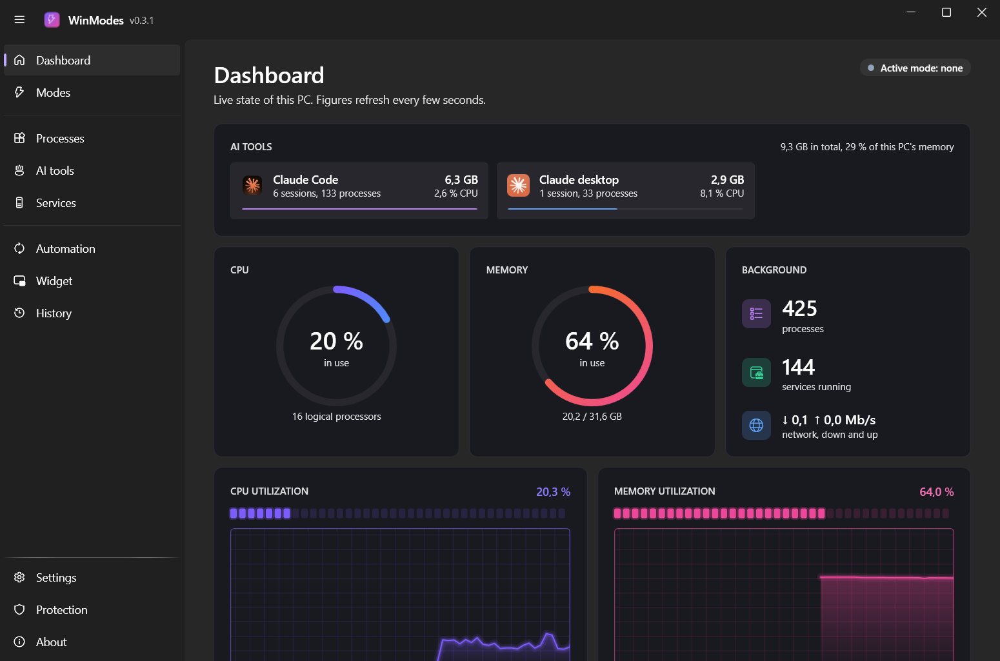
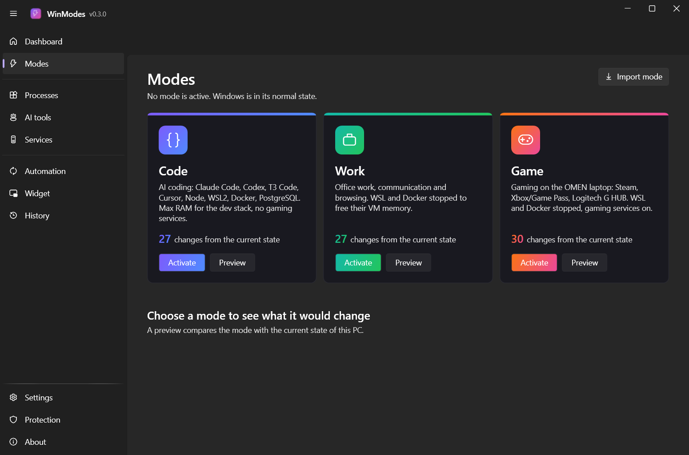
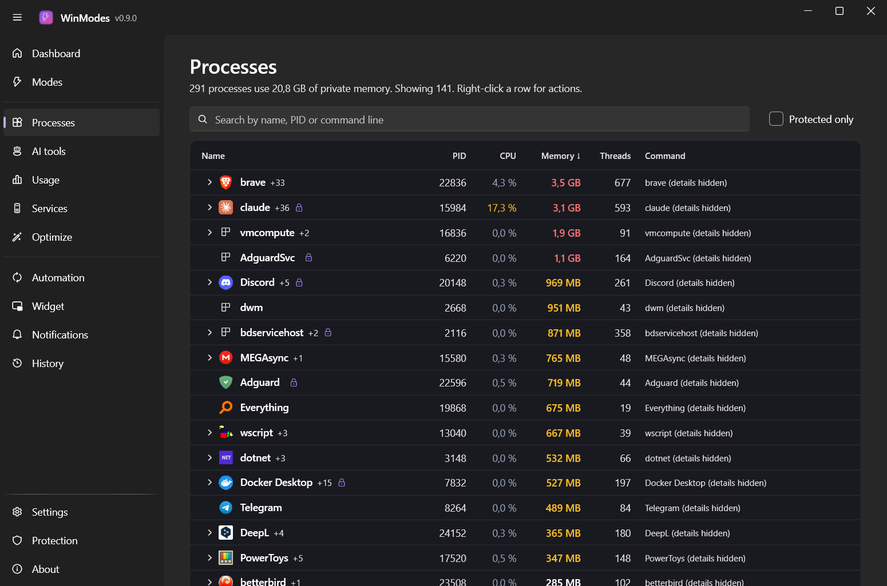
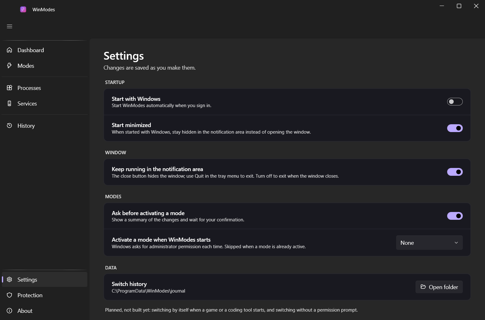

# WinModes

Reversible Windows 11 modes for coding, work and gaming.

WinModes switches your PC between modes (Code, Work, Game) to free memory and cut background load, without the usual damage of "debloat" tools: nothing is uninstalled, no security feature is weakened, and every switch can be undone.



> **Status: early version (0.1.0).** It works on the author's machine and is covered by automated tests, but it has not been tested on many PCs. Read [Safety](#safety) before activating a mode.

## What it does

- **Modes**: each mode stops the services it does not need, closes or launches apps, sets the power plan and starts or stops WSL and Docker Desktop.
- **Preview before anything changes**: every mode shows exactly what it would change on your PC, compared with its current state.
- **Undo**: the state of each service is recorded before it is touched, and "Deactivate" restores it.
- **Dashboard**: CPU and memory gauges, 60-second history graphs, what each AI tool uses at a glance, top memory consumers.
- **Processes page**: process tree with child processes, PID, CPU, memory, threads and command line; search, sort, and a right-click menu (end task, end process tree, open file location, copy).
- **AI tools page**: every running session of Claude Code, Claude desktop, Codex, Cursor, VS Code and others, with the project folder it works in and all the processes it started.
- **Services page**: search, filters, real app icons, and a lock on everything that is protected.
- **Tray meter and desktop widget** (both optional): the notification-area icon can show the memory used by AI tools, and a small always-on-top panel shows CPU, memory and AI tools.
- **Settings**: start with Windows, start minimized, keep running in the notification area, activate a mode at startup.

| Modes | Processes | Settings |
|---|---|---|
|  |  |  |

## Safety

WinModes is built around a hard blocklist, [`data/protected.json`](data/protected.json). No mode can stop, disable or remove:

- security: Microsoft Defender, third-party antivirus, the firewall, Windows Update;
- WSL, Hyper-V networking and Docker components;
- winget, the Microsoft Store, Chocolatey prerequisites, Edge and WebView2;
- developer and AI tools, and the apps listed as protected.

Other rules enforced by the engine:

- Services are set to **Manual, never Disabled**.
- A service still needed by another running service is skipped.
- Undo only restores a value that WinModes itself set; if something else changed it since, it is left alone.
- Apps are asked to close; they are never force-killed.
- Service changes run in a small separate program that asks for administrator permission once per switch. The main window never runs as administrator.

Known limitations:

- **Work and Game modes shut down WSL and Docker Desktop.** Running containers and WSL sessions end. Undo does not restart them, and it does not reopen closed apps.
- **No installer yet.** When run from a build folder, the elevated helper reads the profiles from that folder, which any program running as you could modify. Do not treat a development build as hardened.
- The profiles in `profiles/` were generated for one machine (an HP OMEN laptop). Generate your own, see below.
- The interface is in English and dark only.

## Download

Get the latest `WinModes-vX.Y.Z-win-x64.zip` from the [Releases page](https://github.com/LinkPhoenix/winmodes/releases), extract it and run `WinModes.exe`. No installation or .NET runtime is needed. See the [changelog](CHANGELOG.md).

## Requirements

- Windows 11 (x64)
- [.NET 10 SDK](https://dotnet.microsoft.com/download/dotnet/10.0), only to build from source
- PowerShell 7 for the scripts in `tools/`

## Build and run

```bash
git clone https://github.com/LinkPhoenix/winmodes.git
cd winmodes
dotnet build
dotnet test
dotnet run --project src/WinModes.App
```

Read-only command line, to list modes and preview a switch:

```bash
dotnet run --project src/WinModes.Cli -- plan code
```

## Make the profiles yours

The mode profiles are generated from a knowledge base of services and apps rated per mode.

1. Export your machine inventory (read-only; the output stays local and is ignored by git):
   ```bash
   pwsh -NoProfile -File tools/export-inventory.ps1
   ```
2. Edit [`profiles/modes.manual.json`](profiles/modes.manual.json): apps to close or launch per mode, power plan, WSL and Docker behaviour, services never to stop.
3. Regenerate the profiles:
   ```bash
   pwsh -NoProfile -File tools/build-profiles.ps1
   ```

The selection rules are described in [`profiles/README.md`](profiles/README.md), and the knowledge base format in [`data/SCHEMA.md`](data/SCHEMA.md). Only entries confirmed by a fetched source can be stopped by a mode.

## Releasing

List the changes under **Unreleased** in `CHANGELOG.md`, then:

```bash
pwsh -NoProfile -File tools/release.ps1 -Bump minor
```

The script runs the tests, updates the version and the changelog, commits, tags and pushes. The release workflow then builds the self-contained package and publishes the GitHub release. Add `-DryRun` to preview without changing anything.

## Project layout

| Path | Content |
|---|---|
| `src/WinModes.Core` | Profiles, protection policy, planner, journaled engine |
| `src/WinModes.App` | WPF app (WPF-UI), dashboard and pages |
| `src/WinModes.Elevated` | Helper that applies service changes with administrator rights |
| `src/WinModes.Cli` | Read-only command line |
| `tests/` | xUnit tests; the engine is tested against fake services |
| `data/` | Knowledge base and protection blocklist |
| `profiles/` | Generated mode profiles and the hand-edited `modes.manual.json` |
| `research/` | Study of other optimizers and UI research |

## Support

WinModes is free for noncommercial use. If it helps you, you can [buy me a coffee](https://buymeacoffee.com/vckh76t96fh).

## Credits

- Built with [.NET](https://dotnet.microsoft.com/) and [WPF-UI](https://github.com/lepoco/wpfui) (MIT).
- Graph style inspired by Task Manager TMOG and the layout by OMEN Gaming Hub. No code or assets from either product are used.
- The knowledge base draws on a study of open-source optimizers (winutil, Win11Debloat, Atlas, Sophia Script, privacy.sexy and others); see [`research/oss-optimizers`](research/oss-optimizers/projects.md).

## License

[PolyForm Noncommercial 1.0.0](LICENSE.md). You may use, modify and share WinModes for any noncommercial purpose. Commercial use is not permitted.

This is a source-available license, not an OSI-approved open-source license, because it restricts commercial use.
