# WinModes

Reversible Windows 11 modes for coding, work and gaming.

WinModes switches your PC between modes (Code, Work, Game, Focus, Eco) to free memory and cut background load, without the usual damage of "debloat" tools: nothing is uninstalled, no security feature is weakened, and every switch can be undone.

It also watches the AI coding tools you run: what each one costs in memory, how much of your Claude Code and Codex plans is left, and how many tokens they used.


> **Status: early version.** It works on the author's machine and is covered by automated tests, but it has not been tested on many PCs. Read [Safety](#safety) before activating a mode.
>
> The screenshots are taken in privacy mode: project names, folders and command lines are hidden.

## What it does

- **Modes**: each mode stops the services it does not need, closes or launches apps, sets the power plan and starts or stops WSL and Docker Desktop. Five come with the app: **Code** (dev stack up, performance plan), **Work** (WSL and Docker stopped), **Game** (best performance plan, notifications off), **Focus** (notifications silenced, screen and PC kept awake on mains power, the dev stack left alone) and **Eco** (Power saver plan for the battery). A mode can also turn on Windows settings and change power values such as when the display turns off; it does so on a copy of your power plan, so your own plans are never edited. You can edit, duplicate, export and import modes.
- **Preview before anything changes**: every mode shows exactly what it would change on your PC, compared with its current state.
- **Undo**: the state of each service is recorded before it is touched, and "Deactivate" restores it.
- **Dashboard**: CPU and memory gauges, 60-second history graphs for CPU, memory, GPU and disk, what each AI tool uses at a glance, top memory consumers.
- **Processes page**: process tree with child processes, PID, CPU, memory, threads and command line; search, sort, and a right-click menu (end task, end process tree, open file location, copy).
- **AI tools page**: every running session of Claude Code, Claude desktop, Codex, Cursor, VS Code and others, with the project folder it works in and all the processes it started.
- **Services page**: search, filters, real app icons, and a lock on everything that is protected; a right-click starts, stops or changes the start type of a service that is not protected.
- **Optimize page**: 81 Windows settings by category (privacy and telemetry, ads and suggestions, search and AI, gaming, background, Explorer), found by reading the code of more than forty open-source Windows optimizers, and the services worth starting only when needed. Each row shows whether it is already applied on your PC and how many of those optimizers ship the same setting. After each write WinModes reads the value back, so a setting that Windows refuses is reported instead of shown as applied. A bar of categories keeps the list short, and every setting opens to show the exact registry values or scheduled tasks it changes, with a tick box for each when there are several, so you can take part of a setting and leave the rest. You choose what to apply; WinModes records the current value first and Undo puts it back, whole or one change at a time. Settings that weaken security or updates are not in the catalog and are refused by the engine. Nothing is uninstalled or deleted.
- **Debloat page**: lists, with their logos and a search, the apps Windows installed for you by category, and removes the ones you pick (Clipchamp, News, Solitaire, Teams, Copilot, the promoted games and apps, Phone Link and more), for your account only. The list comes from comparing what the well-known optimizers remove and what they break by going too far, so each app is marked *Safe* or *Check first* with what stops working without it. Every removal is recorded and *Restore* brings an app back from the files that stay on the PC. The Microsoft Store, App Installer (winget), Edge, WebView2, the framework packages, Windows Security, the shell, Windows Terminal, the image and video codecs and the apps of your daily tools are never offered. OneDrive can be uninstalled from the same page, after checks on redirected folders, sign-in and files that exist only online.
- **Startup page**: lists what starts with Windows and turns items on or off the way Task Manager does (nothing is deleted, each item can be reset). Security software, audio drivers and your own tools are protected.
- **Usage page** (optional, off by default): the **tokens** Claude Code and Codex used (total, new input, output, cache, per day, per model and per project) and how much **memory** each AI tool held per project, over the last day, week or month. The tokens are counted from the usage figures in the logs of the two tools, never from the text of a conversation; everything stays on your PC.
- **MCP servers in double**: the AI tools page shows the MCP servers that several sessions each started, and the memory they hold together.
- **Idle sessions**: flagged after 30 minutes without CPU use; end them by hand, or let WinModes do it after a delay you choose (off by default).
- **Automatic switching** (optional, off by default; one switch on the Modes page, in the tray menu and on the Automation page): Code mode starts by itself when Claude Code, Codex, Cursor, T3 Code, OpenCode, Windsurf or VS Code opens, and ends after the last of them has been closed for a minute (the wait is yours to choose), so going from one tool to another, or running several, never makes the PC go back and forth. Claude Code is told apart from the Claude chat app. You can add rules of your own, such as "when `cs2.exe` runs, activate Game mode", "on battery, activate Work mode" or "from 09:00 to 18:00, activate Code mode". A mode you chose yourself is never replaced or undone, and nothing is switched during the first 30 seconds after WinModes starts.
- **Taskbar and desktop widget** (both optional): a small panel next to your app icons (or on the desktop) shows the active mode, CPU, memory, network, the memory used by AI tools and the **plan usage of Claude Code and Codex**: 5 hour and weekly limits, the weekly limit of a model that has its own, and the limit resets kept in reserve. It uses the free room of the taskbar whether the icons are centred or on the left, shows less when there is little room, follows an auto-hide taskbar and can hide during full-screen apps. The notification-area icon can also show the memory used by AI tools.
- **Hover cards**: rest the mouse on Claude, Codex or the AI tools figure and a card opens after a moment with each limit, a coloured bar and the time it resets, or with what each AI tool uses. It never takes the mouse or the focus.
- **Plan usage, read reliably**: from the status line of Claude Code and the files of Codex, or online. Signing in to a "WinModes account" in your browser gives a session of its own, renewed by itself, that never touches the sign-in of the tools. If the usage does not appear, the *Check Claude Code* and *Check Codex* buttons say what is missing.
- **Notifications** (all optional, with a master switch and quiet hours): a plan limit running low, reached, available again or a limit reset added to your reserve; the memory of AI tools; an idle session ended; a mode switch; a new release; a sign-in that expired. Each one is sent once per cycle and remembered across restarts, so a limit left at 0 % does not ring at every start.
- **Privacy mode**: hides project names, folders, command-line details and your account name, for screen sharing and screenshots.
- **Updates**: WinModes checks the GitHub releases at startup (can be turned off); an installed copy can download the new installer, check it against the release checksums and start it. Releases from 0.9.0 on are **signed**: the checksum list carries a signature that only the maintainer can make, and the app refuses an update that is unsigned or wrongly signed.
- **Report and support file**: export a snapshot of the PC (program names and totals only) to ask for help, or create a zip to attach to a bug report (version, facts about the PC, your settings and the error logs, with your user name, PC name, e-mail addresses and anything that looks like a key taken out). Nothing is sent.
- **Dark and light themes**.
- **Four languages**: English (default), French, Spanish and Italian, chosen on the Settings page.
- **Welcome guide** on first run, and a **Settings** page: start with Windows (WinModes warns you if that entry points to a file that no longer exists), start minimized, keep running in the notification area, shortcuts, WSL memory limit.

### The taskbar widget and its cards

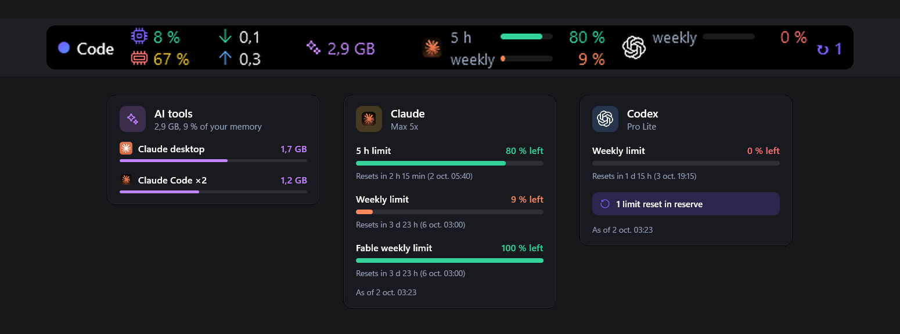

### Pages

| Modes | AI tools |
|---|---|
|  | 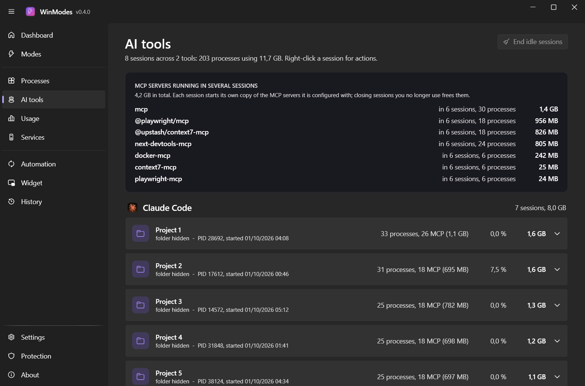 |

| Processes | Services |
|---|---|
|  | 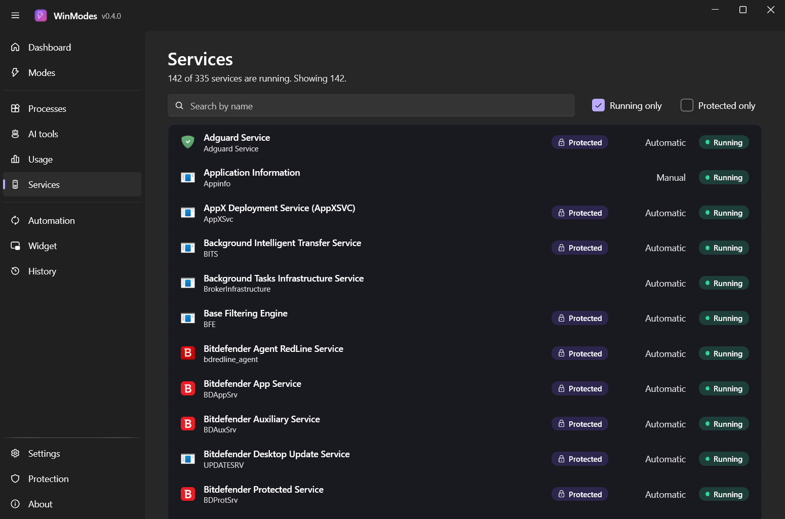 |

| Optimize | Usage |
|---|---|
| 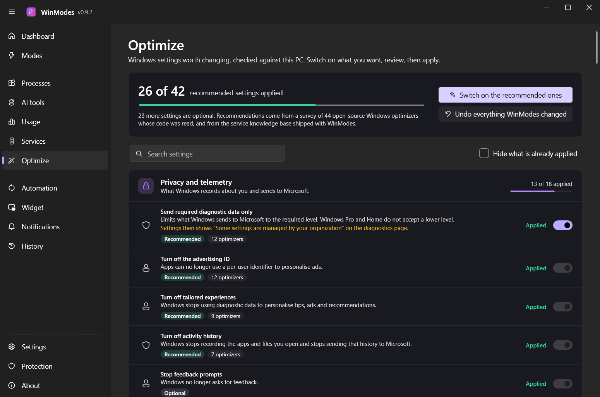 | 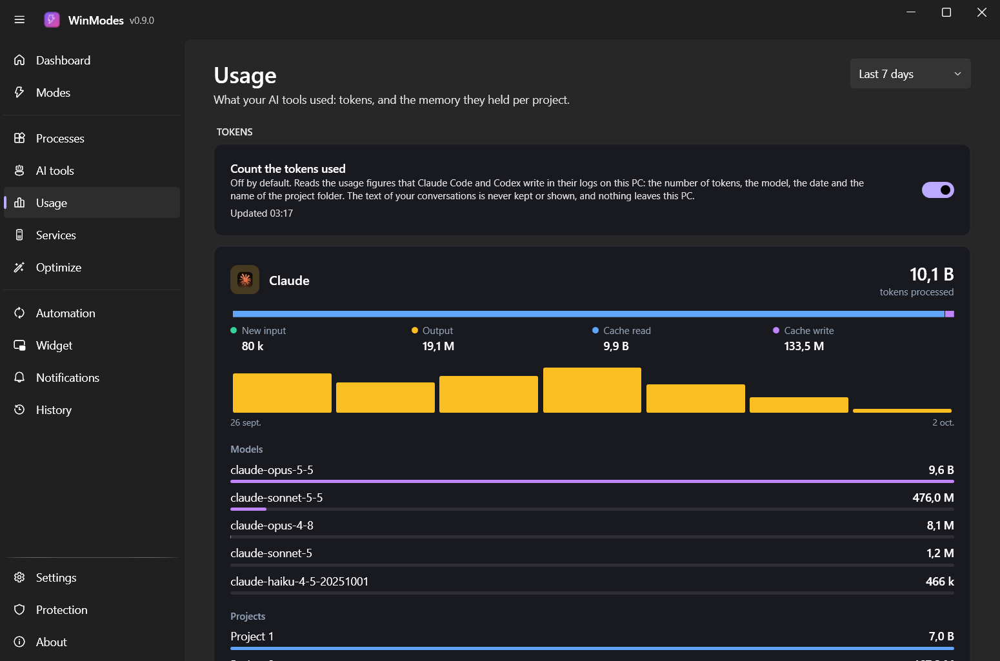 |

| Automation | Notifications |
|---|---|
| 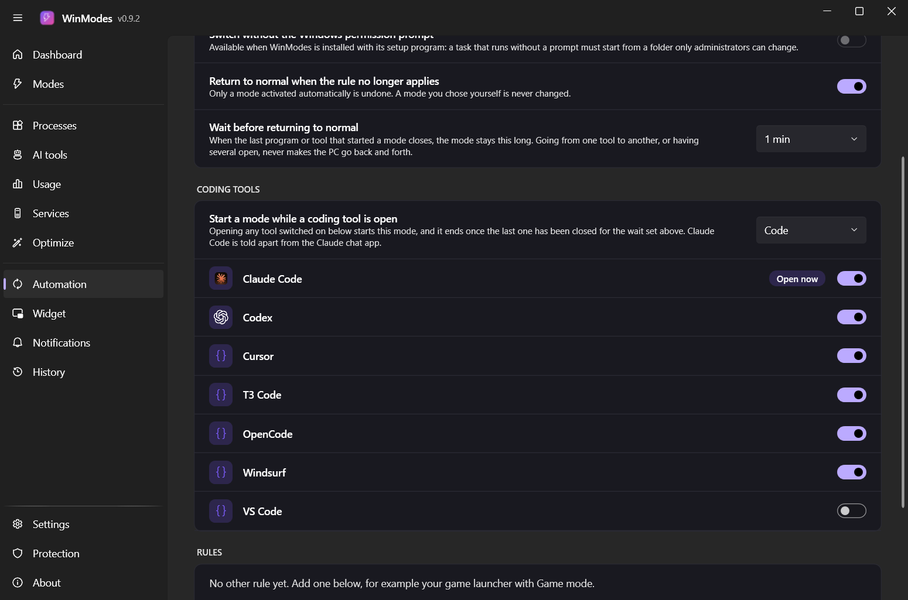 | 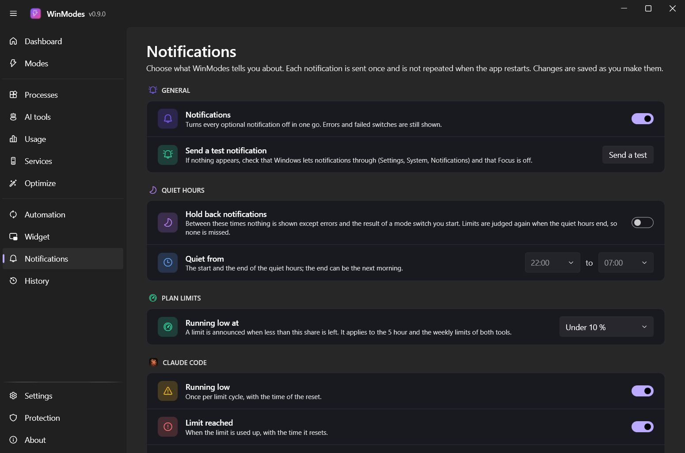 |

| Widget | Widget, plan usage |
|---|---|
| 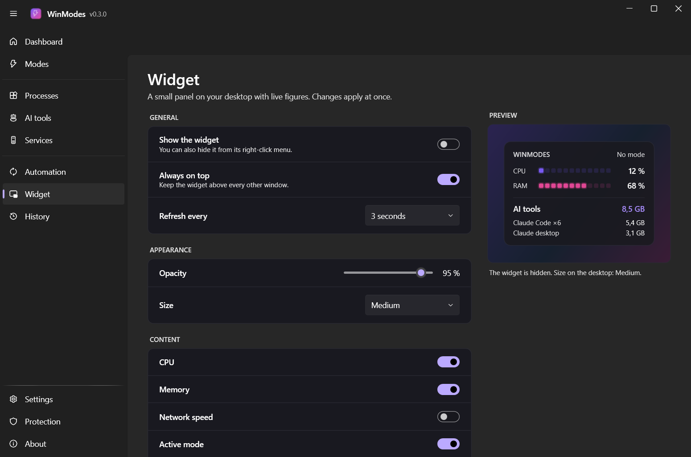 | 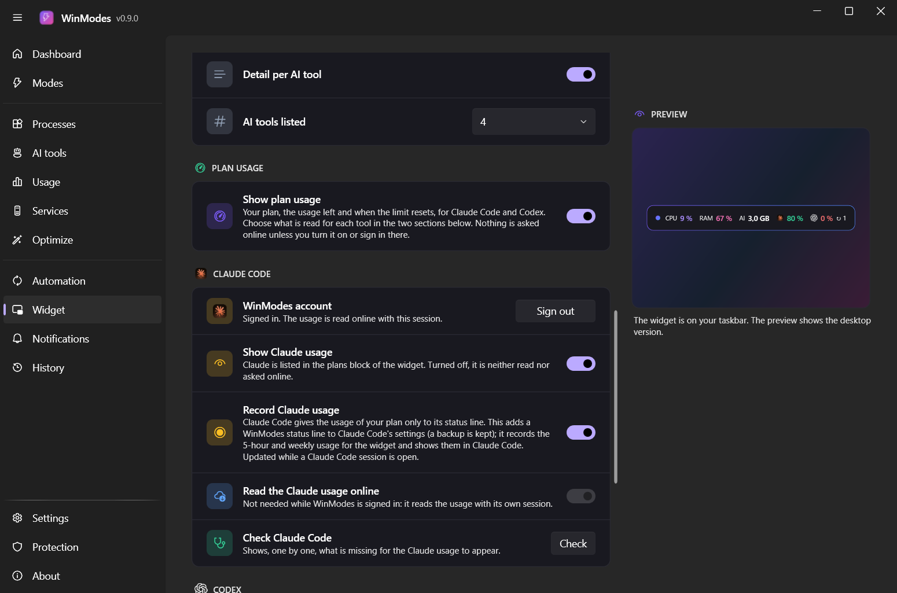 |

| Settings | About |
|---|---|
|  | 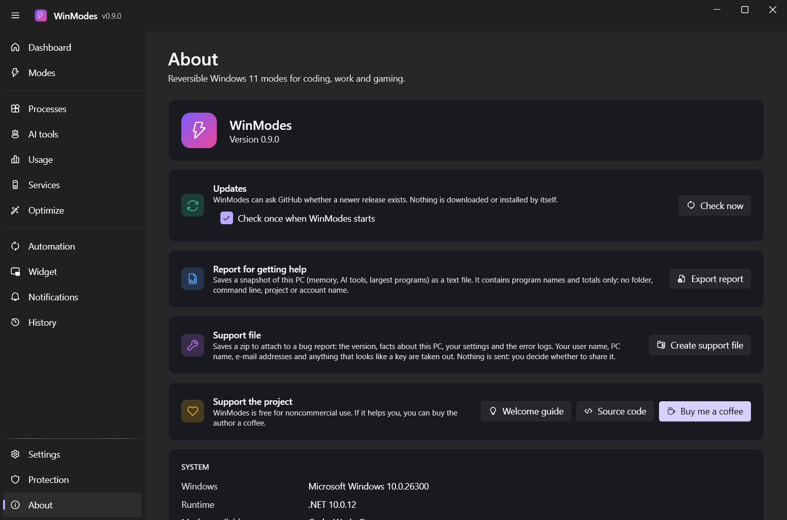 |

| Debloat | Startup |
|---|---|
| 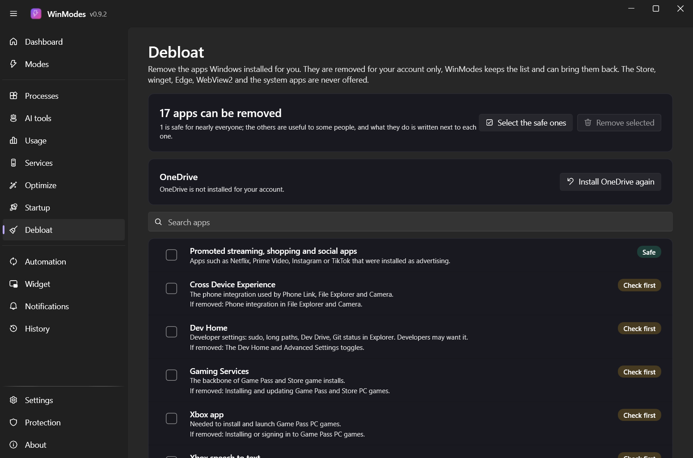 | 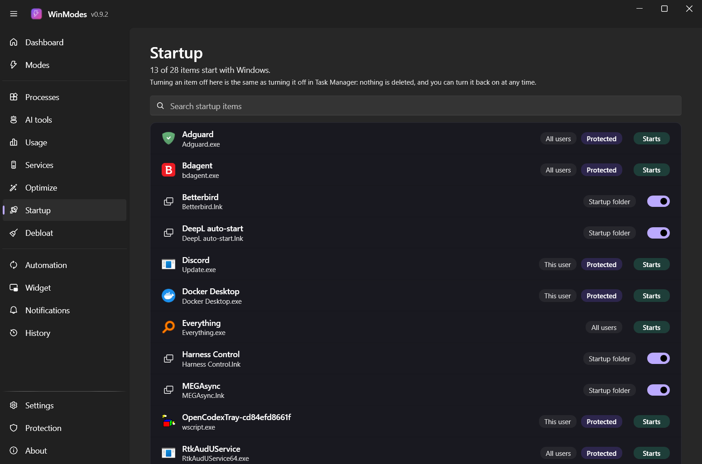 |

| Welcome guide |
|---|
| 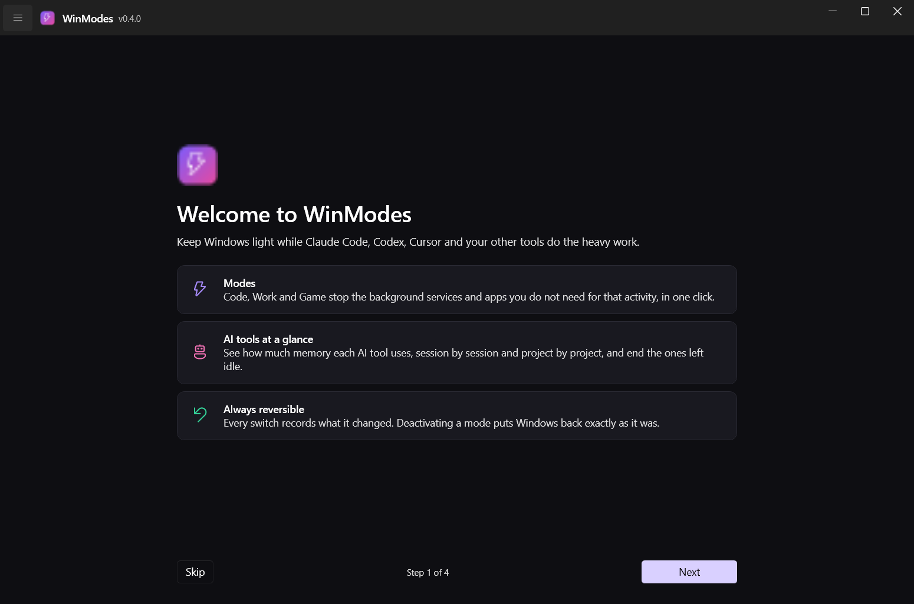 |

## Safety

WinModes is built around a hard blocklist, [`data/protected.json`](data/protected.json). No mode can stop, disable or remove:

- security: Microsoft Defender, third-party antivirus, the firewall, Windows Update;
- WSL, Hyper-V networking and Docker components;
- winget, the Microsoft Store, Chocolatey prerequisites, Edge and WebView2;
- developer and AI tools, and the apps listed as protected.

Other rules enforced by the engine:

- A mode sets services to **Manual, never Disabled**. A service is disabled only when you choose it yourself on the Optimize or Services page.
- A service still needed by another running service is skipped.
- Undo only restores a value that WinModes itself set; if something else changed it since, it is left alone.
- Apps are asked to close; they are never force-killed.
- Service changes run in a small separate program that asks for administrator permission once per switch. The main window never runs as administrator.

Known limitations:

- **Work and Game modes shut down WSL and Docker Desktop.** Running containers and WSL sessions end. Undo does not restart them, and it does not reopen closed apps.
- **The packages are not code-signed with a Windows certificate yet.** Windows SmartScreen warns on first launch ("Windows protected your PC"); choose *More info*, then *Run anyway*, or build from source. The updates themselves are checked by WinModes with its own signature, see Updates above.
- **Portable and development builds are not hardened.** There, the elevated helper reads the protected list and the profiles from the app folder, which any program running as you could modify. The installer puts the protected list under Program Files, where changing it needs administrator rights; only the mode profiles stay editable, and the protected list is enforced whatever a profile says.
- Automatic switching shows the Windows permission prompt at each switch, unless you turn on the silent switch, which is available only when WinModes is installed with its setup program.
- Plan usage depends on what Anthropic and OpenAI let other programs read, and neither documents it for third parties: it can stop working without notice. WinModes then asks less and less often instead of insisting.
- The profiles in `profiles/` were generated for one machine (an HP OMEN laptop). Generate your own, see below.

## Download

From the [Releases page](https://github.com/LinkPhoenix/winmodes/releases):

| File | Use |
|---|---|
| `WinModes-vX.Y.Z-setup-win-x64.exe` | Installer. Installs into Program Files, adds a Start menu entry and an uninstaller. Uninstalling first undoes the active mode. |
| `WinModes-vX.Y.Z-portable-win-x64.zip` | Portable. Extract anywhere and run `WinModes.exe`; nothing is installed. |
| `SHA256SUMS.txt` | Checksums of both files. |
| `SHA256SUMS.txt.sig` | Signature of the checksums, checked by the app before it installs an update. |

Neither needs the .NET runtime. See the [changelog](CHANGELOG.md).

### Beta releases

New features are tested first in a **beta**, published as a *pre-release* named `vX.Y.Z-beta.YYYYMMDD` (with `.2`, `.3`… when several come out the same day) with the same files as a stable release. A beta wears a **Beta** tag next to its version in the title bar and on the About page.

- You choose the **update channel** on the About page, in the Updates section. On *Stable* (the default of a stable copy) WinModes only offers the latest stable release. On *Beta* (the default of a beta copy) it also offers the newer betas, and the stable version of the same number when it comes out. Going back to Stable never downgrades: a beta waits for the next stable version.
- A beta installs over a stable copy and the other way round (same installer identity), and it keeps your settings and journals.
- Betas come from the `beta` branch, stable releases from `main`. Please report what you find in the [issues](https://github.com/LinkPhoenix/winmodes/issues).

## Requirements

- Windows 11 (x64)
- [.NET 10 SDK](https://dotnet.microsoft.com/download/dotnet/10.0), only to build from source
- PowerShell 7 for the scripts in `tools/`

## Build and run

```bash
git clone https://github.com/LinkPhoenix/winmodes.git
cd winmodes
dotnet build
dotnet test
dotnet run --project src/WinModes.App
```

Read-only command line, to list modes and preview a switch:

```bash
dotnet run --project src/WinModes.Cli -- plan code
```

## Make the profiles yours

The mode profiles are generated from a knowledge base of services and apps rated per mode.

1. Export your machine inventory (read-only; the output stays local and is ignored by git):
   ```bash
   pwsh -NoProfile -File tools/export-inventory.ps1
   ```
2. Edit [`profiles/modes.manual.json`](profiles/modes.manual.json): apps to close or launch per mode, power plan, WSL and Docker behaviour, services never to stop.
3. Regenerate the profiles:
   ```bash
   pwsh -NoProfile -File tools/build-profiles.ps1
   ```

The selection rules are described in [`profiles/README.md`](profiles/README.md), and the knowledge base format in [`data/SCHEMA.md`](data/SCHEMA.md). Only entries confirmed by a fetched source can be stopped by a mode.

## Releasing

List the changes under **Unreleased** in `CHANGELOG.md`, then:

```bash
pwsh -NoProfile -File tools/release.ps1 -Bump minor
```

The script runs the tests, updates the version and the changelog, commits, tags and pushes. The release workflow then builds the installer and the portable zip, signs the checksums and publishes the GitHub release. Add `-DryRun` to preview without changing anything.

A beta is cut from the `beta` branch with `-Beta`: it commits only the version, tags `vX.Y.Z-beta.YYYYMMDD`, pushes the branch and the tag, and the workflow publishes a pre-release. The changelog keeps its **Unreleased** section for the stable release.

```bash
pwsh -NoProfile -File tools/release.ps1 -Beta -DryRun
```

Releases are signed with an ECDSA P-256 key. The public key is committed in `src/WinModes.Core/Updates/update-public-key.pem` and built into the app; the private key is never in the repository and is read from the GitHub secret `WINMODES_UPDATE_KEY`. `tools/new-update-key.ps1` creates a pair, and `tools/package.ps1` refuses to build a release without the private key once the public key exists.

To build the packages locally (the installer needs [Inno Setup](https://jrsoftware.org/isinfo.php) 6 or 7):

```bash
pwsh -NoProfile -File tools/package.ps1 -Version 0.3.0   # or 0.9.3-beta.20261002 for a beta
```

## Project layout

| Path | Content |
|---|---|
| `src/WinModes.Core` | Profiles, protection policy, planner, journaled engine |
| `src/WinModes.App` | WPF app (WPF-UI), dashboard and pages |
| `src/WinModes.Elevated` | Helper that applies service changes with administrator rights |
| `src/WinModes.StatusLine` | Tiny program Claude Code runs as its status line, to record the usage of your plan for the widget |
| `src/WinModes.Cli` | Read-only command line |
| `tests/` | xUnit tests; the engine is tested against fake services |
| `data/` | Knowledge base and protection blocklist |
| `profiles/` | Generated mode profiles and the hand-edited `modes.manual.json` |
| `installer/` | Inno Setup script |
| `tools/` | Scripts to build the profiles, package, sign and release, and to check the interface |
| `research/` | Study of other optimizers and UI research |

## Support

WinModes is free for noncommercial use. If it helps you, you can [buy me a coffee](https://buymeacoffee.com/vckh76t96fh).

## Credits

- Built with [.NET](https://dotnet.microsoft.com/) and [WPF-UI](https://github.com/lepoco/wpfui) (MIT).
- Graph style inspired by Task Manager TMOG and the layout by OMEN Gaming Hub. No code or assets from either product are used.
- The knowledge base draws on a study of open-source optimizers (winutil, Win11Debloat, Atlas, Sophia Script, privacy.sexy and others); see [`research/oss-optimizers`](research/oss-optimizers/projects.md).

## License

[PolyForm Noncommercial 1.0.0](LICENSE.md). You may use, modify and share WinModes for any noncommercial purpose. Commercial use is not permitted.

This is a source-available license, not an OSI-approved open-source license, because it restricts commercial use.
